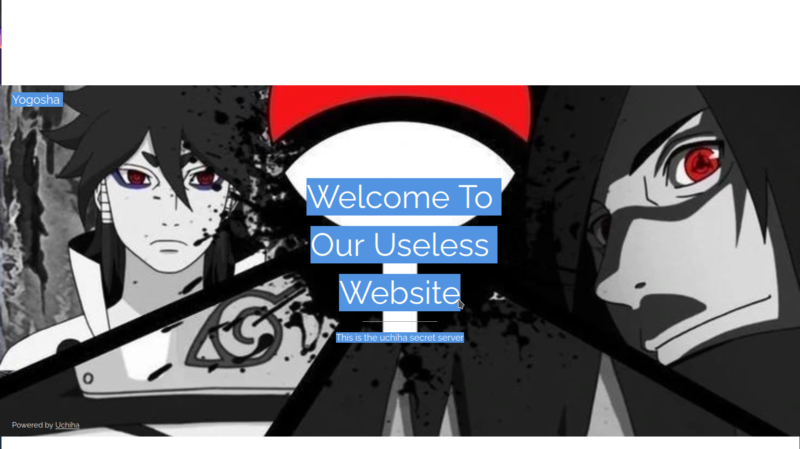
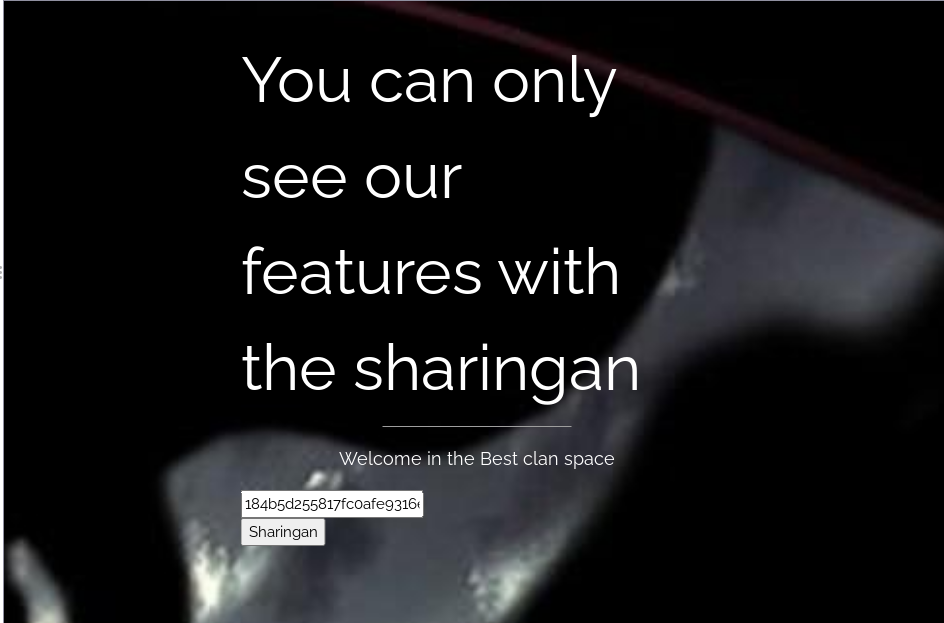
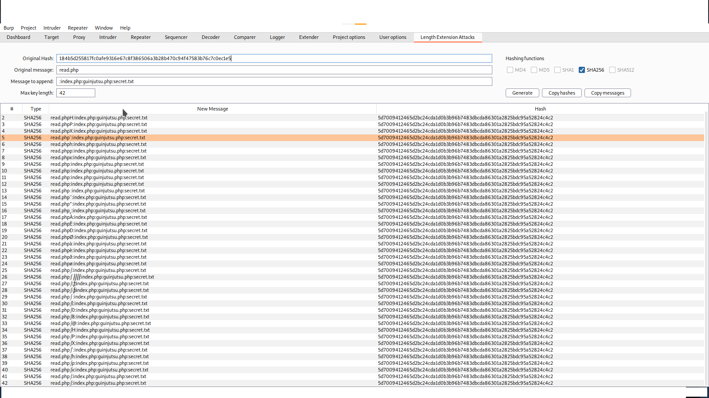
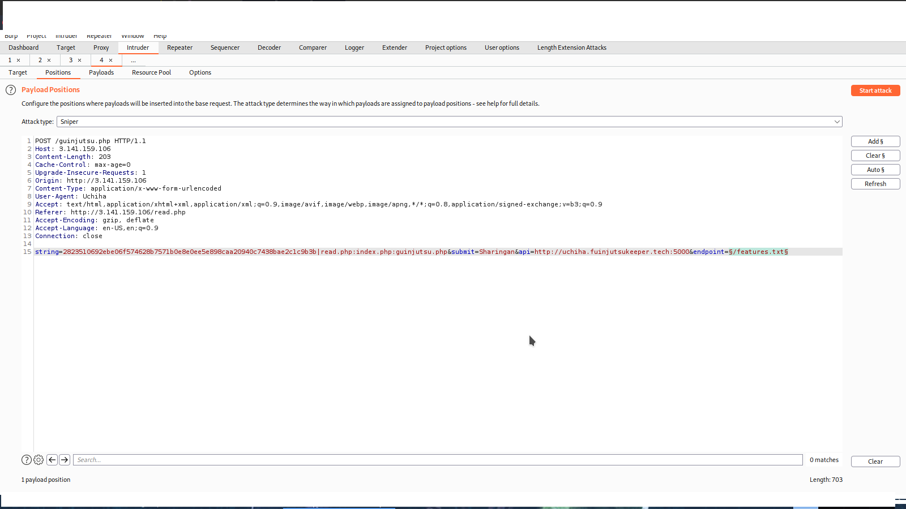
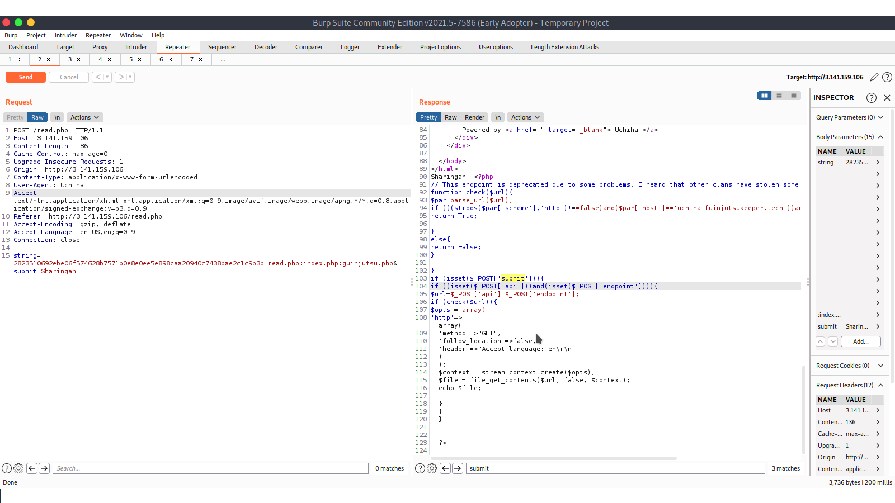
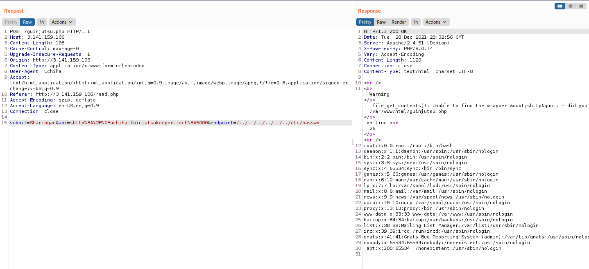
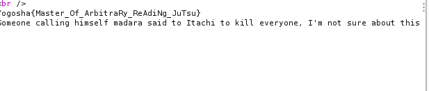

# [Yogosha Christmass Challenge](https://christmas.yogosha.com) - Uchiha Or Evil ?

# Table of Content
- [Yogosha Christmass Challenge - Uchiha Or Evil ?](#yogosha-christmass-challenge---uchiha-or-evil-)
- [Table of Content](#table-of-content)
  - [Introduction](#-introduction)
    - [Previous challenge info](#previous-challenge-info)
  - [Challenge Details](#challenge-details)
    - [Description :](#description-)
    - [Hints :](#hints-)
    - [Category: `Web`](#category-web)
    - [Points: `1000`](#points-1000)
    - [Year : `2021`](#year--2021)
  - [TL;DR](#-tldr)
  - [Solution](#-solution)
  - [Part 1:](#part-1)
  - [Part 2:](#part-2)
  - [Part 3:](#part-3)
  - [Flag:](#flag)
  - [References](#-references)


## Introduction
---
This challenge is part of a quest so in order to get to this challenge you have to complete the previous OSINT challenge <strong> Welcome Christmass</strong>
but all we need for this challenge is summed up in this picture

### Previous challenge info


## Challenge Details 

---
### Description :
`You found some important stuffs! the Hockage is proud of you o// let's dive in the real stuff now can you really hack the Uchiha?`

### Hints :

`Is using hashes that way always secure ? Shisui is not sure about that since the old state of a hash is saved`

### Category: `Web`
### Points: `1000`  

### Year : `2021`

## TL;DR
---
- Using Burpsuite is highly recomended as you'll see i managed to do everything from within burp
- checkout robots.txt
- execute a hash-length extension attack to retrieve the guinjutsu.php source code
- use strpos() function to your advantage to pass the scheme === http condition  in order to pass an arbitrary scheme 
- finaly directory traversal to the /secret.txt file to retrive the flag + info for the next challenge 

## Solution
---
First of all this is my first time ever dealing with a web task in a ctf so I learned a lot from it and I hope you do too!    
I'll try to go step by step into explaining each step so let's dive in   

## Part 1: 
  
Upon entering the url http://3.141.159.106 we are greeted by a welcome page 


I check if robots.txt exists and what do you know ?  we get this response back  

 `User-agent: Uchiha 
 Allow:/read.php`

 Why did i look for a particular robots.txt page you can find more [here](https://developer.mozilla.org/en-US/docs/Glossary/Robots.txt) 

 so we know there is a read.php page and the only way to access it is to modify the User-agent header to Uchiha 

 I immediately fire up burpsuite, start a new project and send a new request to read.php    
  
---
## Part 2:


we are greeted with a juicy input field containing some sort of hash  
on submitting that value we get in the response the following php source code:  
```include secret.php 
if(isset($_POST['string'])){
    $arr=eplode("|",$_POST['string']);
    $filenames=$arr[1];
    $hash=$arr[0];
    if($hash===hash("sha256",$SECRET.$filenames) && preg_match("/\//",$filenames)===0){
        foreach(explode(":",$filenames) as $filename) {
            if(in_array($filename, ["read.php"])){
                $jutsu=file_get_contents(filename);
                echo "Sharinga :".$jutsu;
            }
        }
    }
    else{
        echo "Verification failed!  You didn't awaken your sharingan!";
    }
} 
```
So after doing  quick review of the code we can see that the input is indeed a [sha256](https://en.wikipedia.org/wiki/SHA-2) followed by a filename to be viewed via [file_get_contents()](https://www.php.net/manual/en/function.file-get-contents.php) also we find out there is a page called guinjutsu.php which would probably be the page  that would lead us to the flag

this part:   
```
$arr=explode("|",$_POST['string']);
$filenames=$arr[1];
$hash=$arr[0];
```
basicaly tells us that the input from the page is a hash and a sha256 hash to be exact followed by a "|" (a pipe) and the other part is supposed to be a filename 

this part is what we'll be looking at 
```
if($hash===hash("sha256",$SECRET.$filenames) && preg_match("/\//",$filenames)===0){
        foreach(explode(":",$filenames) as $filename) {
            if(in_array($filename, ["read.php"])){
                $jutsu=file_get_contents(filename);
                echo "Sharinga :".$jutsu;
            }
        }
    }
```
We need to pass these conditions in order to get the contents of the file  

we notice something here:
```
$hash===hash("sha256",$SECRET.$filenames)
```

`$filenames` prepended by  `$SECRET`   is hashed using sha256. and then compared with `$hash` provided in the input!  
After some googling work and with the help of the [hint](#hints-),We stumbled upon a type of attack against that logic of hashing called a [hash length extension attack](https://blog.skullsecurity.org/2012/everything-you-need-to-know-about-hash-length-extension-attacks)  
What it says is basically we need to know the old state of the hash, the input and the length of the `$SECRET` that way we can append anything we want and genereate a new signature!!  
the problem is that the length of the secret was unknown so only one thing was possible: Brute force it!   
I was using burpsuite so it was very very convenient that i stumbled upon [this](https://portswigger.net/bappstore/f156669cae8d4c10a3cd9d0b5270bcf6) cool extension here:  
  


We feed it what we have and put message to append: `:guinjutsu.php` and we choose the max length and then configure the intruder to start our brute force:

  

  
and start our attack
  


We notice we had a different response in the 42th request due to the length of it being different   
We send it to the [repeater](https://portswigger.net/burp/documentation/desktop/tools/repeater/using)
  
  ---
## Part 3:  

 and there we have it! the source code of `guinjutsu.php`:

 ```
 // This endpoint is deprecated due to some problems, I heard that other clans have stolen some jutsus
function check($url){
    $par=parse_url($url);
    if (((strpos($par['scheme'],'http')!==false)and($par['host']=='uchiha.fuinjutsukeeper.tech'))and($par['port']==5000)){
        return True;
 
    }
    else{
        return False;
    }
 
}
if (isset($_POST['submit'])){
    if ((isset($_POST['api']))and(isset($_POST['endpoint']))){
        $url=$_POST['api'].$_POST['endpoint'];
        if (check($url)){
            $opts = array(
  'http'=>array(
    'method'=>"GET",
    'follow_location'=>false,
    'header'=>"Accept-language: en\r\n" 
  )
);
$context = stream_context_create($opts);
$file = file_get_contents($url, false, $context);
echo $file;
 
        }
    }
}
 ```
 aaand another PHP code review so let's see what we got here:  
 ```
 (isset($_POST['submit'])){
    if ((isset($_POST['api']))and(isset($_POST['endpoint']
 ```
 so the page is expecting values to be sent via 3 POST parameters but we should focus more on `api` and `endpoint`  .  
 we move on to the next part:

 ```
 $url=$_POST['api'].$_POST['endpoint'];
        if (check($url)){
            $opts = array(
  'http'=>array(
    'method'=>"GET",
    'follow_location'=>false,
    'header'=>"Accept-language: en\r\n" 
  )
);
$context = stream_context_create($opts);
$file = file_get_contents($url, false, $context);
echo $file;
}
 ```
 so <em>api+endpoint</em> constitues some url and that url is checked using this function 
 `check()`:

 ```
function check($url){
   $par=parse_url($url);
   if (((strpos($par['scheme'],'http')!==false)and($par['host']=='uchiha.fuinjutsukeeper.tech'))and($par['port']==5000)){
       return True;

   }
   else{
       return False;
   }

}
 ```
 this functions checks the validity of the url so our url must be something that looks like this `http://uchiha.fuinjutsukeeper.tech:5000/<endpoint>`

after looking for a while and googling I notice after reading the documentation of [strpos()](https://www.php.net/manual/en/function.strpos.php) i realize the scheme check wasn't strict so basically `strpos()` only checks if http is present or not 

and something I learned from the manual page of [file_get_contents()](https://www.php.net/manual/en/function.file-get-contents.php) is that if it recieves an unknown scheme it will output the file from the filesystem! (weird php I know) I had to test this so here goes:  
  
And what do you know? Php throws a warning and outputs /etc/passwd from the filesystem
remembering the information we got from the first challenge we had to look for /secret.txt so we pass this payload:  
`shttp://uchiha.fuinjutsukeeper.tech:5000/../../../../../secret.txt`  _  

And voila: 

 

## Flag:   
`Yogosha{Master_Of_ArbitraRy_ReAdiNg_Jutsu}`  
## References
 ---
 1. https://www.php.net/manual/en/index.php
 2. https://portswigger.net/burp/documentation
 3. https://blog.skullsecurity.org/2012/everything-you-need-to-know-about-hash-length-extension-attacks
